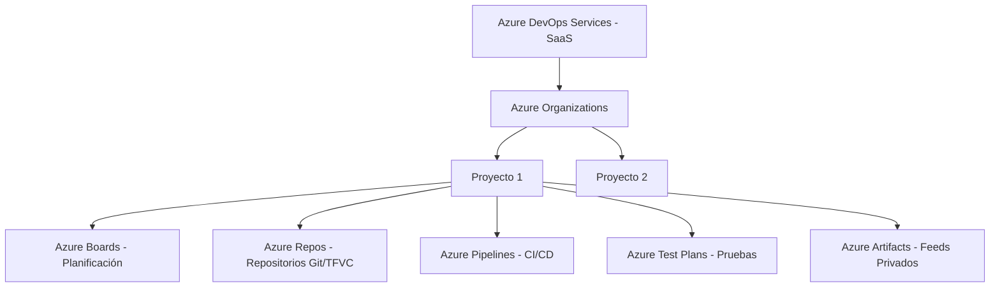

# 📚 Sesión 1: Conocimiento General y Navegación Guiada

Esta sesión de 4 horas proporciona una introducción exhaustiva a **Azure DevOps**, detallando su arquitectura, opciones de licenciamiento, modelos de operación sugeridos, gobernanza y aislamiento seguro de entornos mediante roles y permisos.

---

## 🕒 Cronograma de la Sesión

```
00:00 ────────────────── 00:45 ───────────── 01:30 ─────────────────── 02:30 ────────────────────── 03:30 ───────── 04:00
  │ Introducción a la       │ Modelo          │ Validación de         │ Parametrización Básica:     │ Preguntas y  │
  │ Arquitectura, Alcance   │ Operativo       │ Prerrequisitos y      │ Usuarios, Roles, Permisos  │ Cierre de la │
  │ y Licenciamiento        │ Esperado        │ Navegación Inicial    │ y Aislamiento de Entornos   │ Sesión       │
```

---

## 📂 Laboratorios de esta Sesión
*   [**Lab 1: Habilitación de Organización y Navegación Inicial**](Laboratorios/Lab1_Navegacion_Habilitacion.md)
*   [**Lab 2: Gestión Ágil con Azure Boards**](Laboratorios/Lab2_Gestion_Agil_Azure_Boards.md)
*   [**Lab 3: Parametrización de Usuarios, Roles, Permisos y Aislamiento**](Laboratorios/Lab3_Parametrizacion_Usuarios_Roles.md)

---

## 📖 Contenido Teórico y de Referencia

### Módulo 1: Introducción a la Arquitectura, Alcance y Licencias (45 min)

#### 1. Arquitectura de Azure DevOps
Azure DevOps es una plataforma DevOps SaaS aprovisionada por Microsoft, aunque también existe en su versión local (Azure DevOps Server). En esta capacitación nos enfocamos en **Azure DevOps Services** (SaaS). 



#### 2. Revisión de Licenciamiento y Acceso
El acceso a Azure DevOps se gestiona mediante niveles de acceso (Access Levels) y licencias asignadas:
*   **Stakeholder (Gratuito e Ilimitado)**:
    *   *Ideal para*: Product Owners, Stakeholders, Gerentes.
    *   *Permite*: Crear/editar Work Items en Boards, ver dashboards, revisar estado de pipelines.
    *   *Restricciones*: No pueden ver/modificar código en Azure Repos, no pueden crear pipelines.
*   **Basic (Primeros 5 usuarios gratis, luego pago mensual)**:
    *   *Ideal para*: Desarrolladores, Ingenieros DevOps, QA.
    *   *Permite*: Acceso completo a Boards, Repos y Pipelines.
*   **Basic + Test Plans (Pago)**:
    *   *Ideal para*: Ingenieros de Control de Calidad (QA) dedicados.
    *   *Permite*: Acceso básico más la suite completa de pruebas manuales y automatizadas.
*   **Visual Studio Subscribers (Incluido en la suscripción de VS)**:
    *   Los usuarios con suscripciones de Visual Studio Professional o Enterprise entran al nivel Basic (o Basic+Test Plans en el caso de Enterprise) sin costo adicional en Azure DevOps.

---

### Módulo 2: Modelo Operativo Esperado (45 min)

#### 1. Cómo estructurar la Organización
Una duda común al adoptar Azure DevOps es: *¿Cuántas organizaciones y proyectos debemos crear?*

> [!IMPORTANT]
> **Mejor Práctica de Estructura**:
> *   **Una única Organización** por empresa o división administrativa para unificar la identidad y facturación.
> *   **Múltiples Proyectos** para delimitar fronteras de seguridad fuertes, o **un único gran proyecto** si los equipos colaboran estrechamente y comparten tableros. Normalmente, se recomienda segmentar por unidades de negocio o grandes productos.

#### 2. Integración frente a Herramientas Externas
Azure DevOps es modular. Si su organización ya utiliza herramientas externas (como GitLab para control de código), no es necesario migrar todo.
*   **Código en GitLab / Orquestación en Azure Pipelines**: Azure Pipelines puede consumir repositorios alojados en GitLab On-Premise o GitLab Cloud mediante conexiones de servicio seguras.
*   **Identidades**: Azure DevOps se integra directamente con **Microsoft Entra ID (Azure AD)**, garantizando que el ciclo de vida del empleado (altas, bajas, cambios de rol) impacte inmediatamente en el acceso a la plataforma de desarrollo.

---

### Módulo 3: Prerrequisitos y Navegación de Habilitación (60 min)

Antes de iniciar cualquier despliegue, es crucial validar:
1.  **Identidades**: Confirmar que los usuarios finales pertenezcan al dominio de Entra ID vinculado a la organización.
2.  **Habilitación de Servicios**: En `Project Settings > Overview`, un Administrador de Proyecto puede apagar o encender módulos específicos (ej. apagar *Repos* si se usa GitLab, o apagar *Test Plans* si no se están licenciando).
3.  **Configuración Regional**: Estructurar los usos horarios y configuraciones de idioma para consistencia en los logs de compilación.

---

### Módulo 4: Parametrización de Usuarios, Roles y Proyectos (60 min)

La seguridad en Azure DevOps sigue el principio de **Privilegio Mínimo** y la herencia de permisos.

#### 1. Grupos de Seguridad Incorporados (Out-of-the-box Groups)
*   **Project Administrators**: Control total sobre el proyecto (no hereda automáticamente control sobre la organización).
*   **Contributors**: Grupo por defecto para desarrolladores. Pueden modificar código, crear ramas, editar pipelines y tableros.
*   **Readers**: Acceso de solo lectura al código, boards y estado de compilación.

#### 2. Aislamiento de Entornos y Conexiones de Servicio
Para evitar que un desarrollador de nivel junior altere el entorno de Producción:
*   Se deben configurar **Service Connections** exclusivas para despliegues.
*   Restringir el uso de estas Service Connections mediante permisos específicos, permitiendo que solo los pipelines aprobados o los miembros del grupo `Aprobadores-Producción` puedan utilizarlas.
*   Implementar **Branch Policies** (políticas de rama) en ramas críticas como `main` o `production`, forzando la revisión de código por pares (Pull Requests) y ejecuciones exitosas de pipelines de validación (CI).

---

> [!TIP]
> Proceda ahora al [**Lab 1**](Laboratorios/Lab1_Navegacion_Habilitacion.md) para comenzar la práctica en la consola de Azure DevOps.
