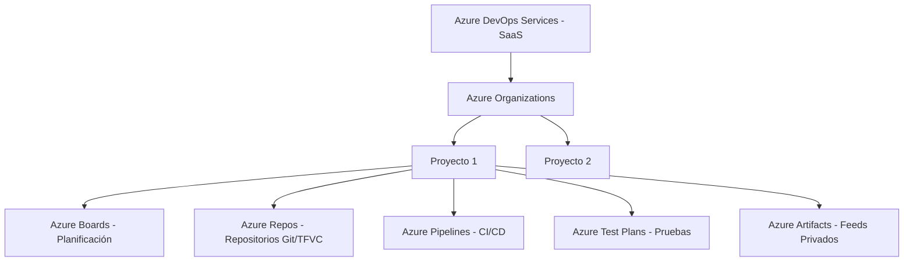

# 📚 Sesión 1: Conocimiento General y Navegación Guiada

Esta sesión de 4 horas proporciona una introducción exhaustiva a **Azure DevOps**, detallando su arquitectura, opciones de licenciamiento, modelos de operación sugeridos, gobernanza y aislamiento seguro de entornos mediante roles y permisos.

---

## 🕒 Cronograma de la Sesión

```
00:00 ────────────────── 00:45 ───────────── 01:30 ─────────────────── 02:30 ────────────────────── 03:30 ───────── 04:00
  │ Introducción a la       │ Modelo          │ Validación de         │ Parametrización Básica:     │ Preguntas y  │
  │ Arquitectura, Alcance   │ Operativo       │ Prerrequisitos y      │ Usuarios, Roles, Permisos   │ Cierre de la │
  │ y Licenciamiento        │ Esperado        │ Navegación Inicial    │ y Aislamiento de Entornos   │ Sesión       │
```

---

## 📂 Laboratorios de esta Sesión
*   [**Lab 1: Habilitación de Organización y Navegación Inicial**](Laboratorios/Lab1_Navegacion_Habilitacion.md)
*   [**Lab 2: Gestión Ágil con Azure Boards**](Laboratorios/Lab2_Gestion_Agil_Azure_Boards.md)
*   [**Lab 3: Parametrización de Usuarios, Roles, Permisos y Aislamiento**](Laboratorios/Lab3_Parametrizacion_Usuarios_Roles.md)

---

## 📖 Contenido Teórico y de Referencia

### Módulo 1: Introducción a la Arquitectura, Alcance y Licencias (45 min)

#### 1. Arquitectura de Azure DevOps
Azure DevOps es una plataforma DevOps SaaS aprovisionada por Microsoft, aunque también existe en su versión local (Azure DevOps Server). En esta capacitación nos enfocamos en **Azure DevOps Services** (SaaS). 


```mermaid
graph TD
    A["Azure DevOps Services - SaaS"] --> B["Azure Organizations"]
    B --> C["Proyecto 1"]
    B --> D["Proyecto 2"]
    C --> E["Azure Boards - Planificación"]
    C --> F["Azure Repos - Repositorios Git/TFVC"]
    C --> G["Azure Pipelines - CI/CD"]
    C --> H["Azure Test Plans - Pruebas"]
    C --> I["Azure Artifacts - Feeds Privados"]
```

#### 2. Revisión de Licenciamiento y Acceso
El acceso a Azure DevOps se gestiona mediante niveles de acceso (Access Levels) y licencias asignadas:
*   **Stakeholder (Gratuito e Ilimitado)**:
    *   *Ideal para*: Product Owners, Stakeholders, Gerentes.
    *   *Permite*: Crear/editar Work Items en Boards, ver dashboards, revisar estado de pipelines.
    *   *Restricciones*: No pueden ver/modificar código en Azure Repos, no pueden crear pipelines.
*   **Basic (Primeros 5 usuarios gratis, luego pago mensual)**:
    *   *Ideal para*: Desarrolladores, Ingenieros DevOps, QA.
    *   *Permite*: Acceso completo a Boards, Repos y Pipelines.
*   **Basic + Test Plans (Pago)**:
    *   *Ideal para*: Ingenieros de Control de Calidad (QA) dedicados.
    *   *Permite*: Acceso básico más la suite completa de pruebas manuales y automatizadas.
*   **Visual Studio Subscribers (Incluido en la suscripción de VS)**:
    *   Los usuarios con suscripciones de Visual Studio Professional o Enterprise entran al nivel Basic (o Basic+Test Plans en el caso de Enterprise) sin costo adicional en Azure DevOps.

#### 3. Componentes de la Suite Azure DevOps
Azure DevOps es una plataforma integrada que proporciona cinco componentes de software principales para cubrir todo el ciclo de vida de desarrollo de software (DevSecOps):

*   **Azure Boards (Planificación y Gestión Ágil)**:
    *   *Propósito*: Permite a los equipos planificar, realizar el seguimiento y discutir el trabajo a través de tableros Kanban, backlogs de producto e iteraciones de Scrum.
    *   *Conceptos Clave*:
        *   **Work Items**: Unidades de trabajo (Epic, Feature, User Story, Task, Bug) que registran el estado, asignación, prioridad y relaciones del trabajo.
        *   **Boards**: Tableros visuales Kanban para optimizar el flujo de trabajo arrastrando tarjetas a lo largo de columnas de estado.
        *   **Backlogs**: Lista priorizada de trabajo pendiente que ayuda a planificar entregas y gestionar el alcance del producto.
        *   **Sprints**: Iteraciones de tiempo fijo (generalmente 2 semanas) para planificar la capacidad del equipo y el compromiso de entregas.
        *   **Queries**: Filtros avanzados para buscar, agrupar y visualizar Work Items mediante informes y gráficos en dashboards.
*   **Azure Repos (Gestión de Control de Versiones)**:
    *   *Propósito*: Aloja repositorios privados de código fuente y proporciona herramientas de revisión por pares mediante flujo de trabajo Git.
    *   *Conceptos Clave*:
        *   **Git**: Sistema de control de versiones distribuido moderno utilizado por defecto en la industria.
        *   **TFVC (Team Foundation Version Control)**: Sistema de control de versiones centralizado tradicional (útil para bases de código heredadas y pesadas).
        *   **Pull Requests (PR)**: Proceso formal de revisión de código por pares que permite proponer cambios, dejar comentarios e inspeccionar la calidad antes de la fusión.
        *   **Branch Policies (Políticas de Ramas)**: Reglas que protegen ramas clave (`main`, `develop`), requiriendo compilaciones exitosas de CI, número mínimo de revisores y aprobación de lints antes de poder fusionar.
*   **Azure Pipelines (Automatización de Compilaciones y Despliegues - CI/CD)**:
    *   *Propósito*: Orquesta de forma automatizada la compilación, pruebas y despliegue continuo de código hacia servidores en la nube o infraestructura local.
    *   *Conceptos Clave*:
        *   **YAML Pipelines**: Pipelines modernos declarados como código en un archivo estructurado dentro del repositorio Git.
        *   **Classic Pipelines**: Interfaz visual histórica basada en diagramas web de arrastrar y soltar (actualmente en desuso, priorizando YAML).
        *   **Self-hosted Agents**: Agentes de ejecución instalados en servidores de la red corporativa del cliente para compilar y desplegar sin abrir puertos de entrada.
        *   **Service Connections**: Conexiones de red seguras a recursos externos (GitLab, Azure, AWS) administradas centralmente sin revelar credenciales al código fuente.
        *   **Environments (Entornos)**: Agrupadores lógicos de infraestructura (VMs, Kubernetes) vinculados a pipelines para aplicar aprobaciones manuales y verificaciones de salud de calidad (*Gates*).
*   **Azure Test Plans (Suite de Control de Calidad)**:
    *   *Propósito*: Proporciona herramientas web avanzadas para planificar, ejecutar y reportar pruebas manuales, automatizadas o exploratorias.
    *   *Conceptos Clave*:
        *   **Test Plans**: Contenedores lógicos de más alto nivel para coordinar campañas de pruebas asociadas a hitos específicos.
        *   **Test Suites**: Agrupadores de pruebas (basadas en requisitos, consultas o estructura estática) que organizan los casos de prueba.
        *   **Test Cases**: Pasos definidos y estructurados con resultados esperados para validar comportamientos funcionales específicos.
        *   **Exploratory Testing**: Pruebas sin guion que registran capturas, video y logs del navegador dinámicamente mediante extensiones web para facilitar el reporte de errores.
*   **Azure Artifacts (Gestión de Paquetes y Dependencias)**:
    *   *Propósito*: Permite a la organización crear, hospedar y compartir feeds de paquetes (npm, NuGet, Python, Maven) de forma segura.
    *   *Conceptos Clave*:
        *   **Private Feeds**: Repositorios privados de componentes y librerías reutilizables exclusivas de la empresa.
        *   **Upstream Sources**: Fuentes ascendentes conectadas a registros públicos (como npmjs o nuget.org) para almacenar en caché las librerías públicas utilizadas, previniendo fallos por caídas de servicios externos.

---

### Módulo 2: Modelo Operativo Esperado (45 min)

#### 1. Cómo estructurar la Organización
Una duda común al adoptar Azure DevOps es: *¿Cuántas organizaciones y proyectos debemos crear?*

> [!IMPORTANT]
> **Mejor Práctica de Estructura**:
> *   **Una única Organización** por empresa o división administrativa para unificar la identidad y facturación.
> *   **Múltiples Proyectos** para delimitar fronteras de seguridad fuertes, o **un único gran proyecto** si los equipos colaboran estrechamente y comparten tableros. Normalmente, se recomienda segmentar por unidades de negocio o grandes productos.

#### 2. Integración frente a Herramientas Externas
Azure DevOps es modular. Si su organización ya utiliza herramientas externas (como GitLab para control de código), no es necesario migrar todo.
*   **Código en GitLab / Orquestación en Azure Pipelines**: Azure Pipelines puede consumir repositorios alojados en GitLab On-Premise o GitLab Cloud mediante conexiones de servicio seguras.
*   **Identidades**: Azure DevOps se integra directamente con **Microsoft Entra ID (Azure AD)**, garantizando que el ciclo de vida del empleado (altas, bajas, cambios de rol) impacte inmediatamente en el acceso a la plataforma de desarrollo.

---

### Módulo 3: Prerrequisitos y Navegación de Habilitación (60 min)

Antes de iniciar cualquier despliegue, es crucial validar:
1.  **Identidades**: Confirmar que los usuarios finales pertenezcan al dominio de Entra ID vinculado a la organización.
2.  **Habilitación de Servicios**: En `Project Settings > Overview`, un Administrador de Proyecto puede apagar o encender módulos específicos (ej. apagar *Repos* si se usa GitLab, o apagar *Test Plans* si no se están licenciando).
3.  **Configuración Regional**: Estructurar los usos horarios y configuraciones de idioma para consistencia en los logs de compilación.

---

### Módulo 4: Parametrización de Usuarios, Roles y Proyectos (60 min)

La seguridad en Azure DevOps sigue el principio de **Privilegio Mínimo** y la herencia de permisos.

#### 1. Grupos de Seguridad Incorporados (Out-of-the-box Groups)
*   **Project Administrators**: Control total sobre el proyecto (no hereda automáticamente control sobre la organización).
*   **Contributors**: Grupo por defecto para desarrolladores. Pueden modificar código, crear ramas, editar pipelines y tableros.
*   **Readers**: Acceso de solo lectura al código, boards y estado de compilación.

#### 2. Aislamiento de Entornos y Conexiones de Servicio
Para evitar que un desarrollador de nivel junior altere el entorno de Producción:
*   Se deben configurar **Service Connections** exclusivas para despliegues.
*   Restringir el uso de estas Service Connections mediante permisos específicos, permitiendo que solo los pipelines aprobados o los miembros del grupo `Aprobadores-Producción` puedan utilizarlas.
*   Implementar **Branch Policies** (políticas de rama) en ramas críticas como `main` o `production`, forzando la revisión de código por pares (Pull Requests) y ejecuciones exitosas de pipelines de validación (CI).

---

> [!TIP]
> Proceda ahora al [**Lab 1**](Laboratorios/Lab1_Navegacion_Habilitacion.md) para comenzar la práctica en la consola de Azure DevOps.
